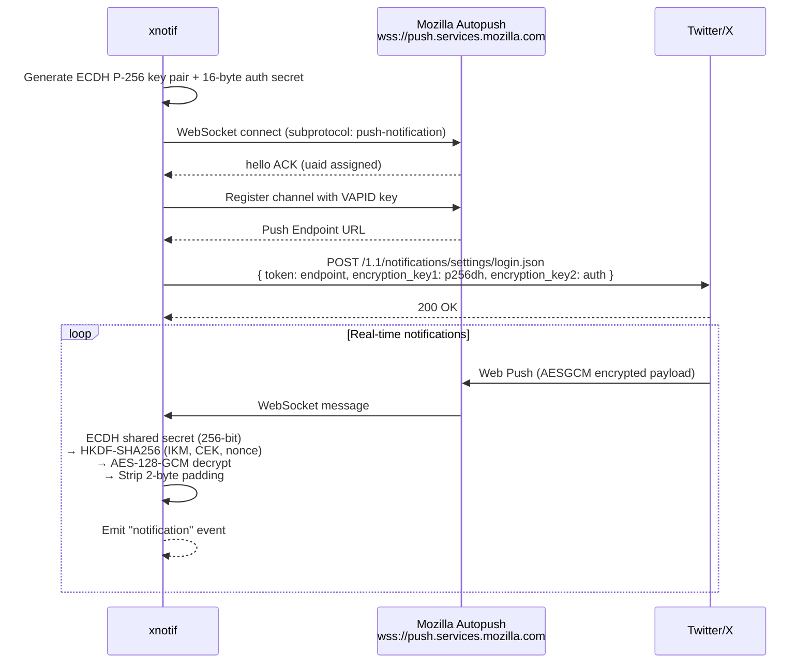

# xnotif

[](https://www.npmjs.com/package/xnotif)
[](https://github.com/yutakobayashidev/xnotif/actions/workflows/ci.yml)
[![DeepWiki](https://img.shields.io/badge/DeepWiki-yutakobayashidev%2Fxnotif-blue.svg?logo=data:image/png;base64,iVBORw0KGgoAAAANSUhEUgAAACwAAAAyCAYAAAAnWDnqAAAAAXNSR0IArs4c6QAAA05JREFUaEPtmUtyEzEQhtWTQyQLHNak2AB7ZnyXZMEjXMGeK/AIi+QuHrMnbChYY7MIh8g01fJoopFb0uhhEqqcbWTp06/uv1saEDv4O3n3dV60RfP947Mm9/SQc0ICFQgzfc4CYZoTPAswgSJCCUJUnAAoRHOAUOcATwbmVLWdGoH//PB8mnKqScAhsD0kYP3j/Yt5LPQe2KvcXmGvRHcDnpxfL2zOYJ1mFwrryWTz0advv1Ut4CJgf5uhDuDj5eUcAUoahrdY/56ebRWeraTjMt/00Sh3UDtjgHtQNHwcRGOC98BJEAEymycmYcWwOprTgcB6VZ5JK5TAJ+fXGLBm3FDAmn6oPPjR4rKCAoJCal2eAiQp2x0vxTPB3ALO2CRkwmDy5WohzBDwSEFKRwPbknEggCPB/imwrycgxX2NzoMCHhPkDwqYMr9tRcP5qNrMZHkVnOjRMWwLCcr8ohBVb1OMjxLwGCvjTikrsBOiA6fNyCrm8V1rP93iVPpwaE+gO0SsWmPiXB+jikdf6SizrT5qKasx5j8ABbHpFTx+vFXp9EnYQmLx02h1QTTrl6eDqxLnGjporxl3NL3agEvXdT0WmEost648sQOYAeJS9Q7bfUVoMGnjo4AZdUMQku50McDcMWcBPvr0SzbTAFDfvJqwLzgxwATnCgnp4wDl6Aa+Ax283gghmj+vj7feE2KBBRMW3FzOpLOADl0Isb5587h/U4gGvkt5v60Z1VLG8BhYjbzRwyQZemwAd6cCR5/XFWLYZRIMpX39AR0tjaGGiGzLVyhse5C9RKC6ai42ppWPKiBagOvaYk8lO7DajerabOZP46Lby5wKjw1HCRx7p9sVMOWGzb/vA1hwiWc6jm3MvQDTogQkiqIhJV0nBQBTU+3okKCFDy9WwferkHjtxib7t3xIUQtHxnIwtx4mpg26/HfwVNVDb4oI9RHmx5WGelRVlrtiw43zboCLaxv46AZeB3IlTkwouebTr1y2NjSpHz68WNFjHvupy3q8TFn3Hos2IAk4Ju5dCo8B3wP7VPr/FGaKiG+T+v+TQqIrOqMTL1VdWV1DdmcbO8KXBz6esmYWYKPwDL5b5FA1a0hwapHiom0r/cKaoqr+27/XcrS5UwSMbQAAAABJRU5ErkJggg==)](https://deepwiki.com/yutakobayashidev/xnotif)

Receive Twitter/X notifications in real-time. No API key, no scraping — just Web Push.

```typescript
import { createClient } from "xnotif";

const client = createClient({
  cookies: { auth_token: "...", ct0: "..." },
});

client.on("notification", (n) => {
  console.log(`${n.title}: ${n.body}`);
});

await client.start();
```

## Install

```bash
npm install xnotif
```

> Requires Node.js >= 22.0.0

## Why xnotif

- **Cookie exposure can be minimized** - Cookies are mainly used for one registration call to `POST /1.1/notifications/settings/login.json`. After registration, notifications are received through Mozilla Autopush WebSocket, so you are not continuously calling internal Twitter endpoints with cookies.
- **Lower ban-risk profile than polling/scraping** - xnotif avoids headless-browser automation and high-frequency private API polling. The runtime traffic pattern is mostly one registration plus push-stream consumption.
- **Avoid unnecessary re-registration** - If you persist `ClientState` from the `connected` event, restart with `state`, and the endpoint is unchanged, xnotif skips the registration call.
- **Simple operations** - No API key provisioning, no webhook server, and no request-signing stack. A single Node.js process can receive and process notifications.

## Notification Payload

Each `notification` event delivers a `TwitterNotification` object:

```jsonc
{
  "title": "@jack",
  "body": "just setting up my twttr",
  "icon": "https://pbs.twimg.com/profile_images/...",
  "timestamp": 1142974214000,
  "tag": "mention_12345",
  "data": {
    "type": "mention",
    "uri": "https://x.com/i/web/status/20",
    "title": "@jack",
    "body": "just setting up my twttr",
    "tag": "mention_12345",
    "lang": "en",
    "scribe_target": "mention",
    "impression_id": "abc123",
  },
}
```

Top-level fields:

| Field       | Type      | Description                                       |
| ----------- | --------- | ------------------------------------------------- |
| `title`     | `string`  | Who triggered the notification                    |
| `body`      | `string`  | Human-readable description                        |
| `icon`      | `string?` | Profile image URL                                 |
| `timestamp` | `number?` | Unix epoch in milliseconds                        |
| `tag`       | `string?` | Deduplication tag                                 |
| `data`      | `object?` | Structured metadata (see `data.type` for routing) |

## Getting Cookies

1. Log in to [x.com](https://x.com)
2. DevTools → Application → Cookies
3. Copy `auth_token` and `ct0`

## State Persistence

Save the `ClientState` from the `connected` event to skip key generation on restart:

```typescript
import { createClient, type ClientState } from "xnotif";

let state: ClientState | undefined = loadFromDisk(); // your persistence

const client = createClient({ cookies: { auth_token: "...", ct0: "..." }, state });

client.on("connected", (s) => saveToDisk(s));

await client.start();
```

## API

### `createClient(options)`

| Option    | Type                                  | Required | Description            |
| --------- | ------------------------------------- | -------- | ---------------------- |
| `cookies` | `{ auth_token: string; ct0: string }` | Yes      | Session cookies        |
| `state`   | `ClientState`                         | No       | Restore previous state |

### Events

| Event          | Payload               | Description                    |
| -------------- | --------------------- | ------------------------------ |
| `notification` | `TwitterNotification` | Decrypted notification         |
| `connected`    | `ClientState`         | Connected — persist this state |
| `error`        | `Error`               | Error (connection continues)   |
| `disconnected` | —                     | WebSocket closed               |
| `reconnecting` | `number`              | Reconnecting in N ms           |

### Methods

- **`client.start()`** — Connect and begin receiving notifications
- **`client.stop()`** — Disconnect

### Low-level Exports

- `Decryptor` — AESGCM Web Push decryption (ECDH + HKDF + AES-128-GCM)
- `AutopushClient` — Mozilla Autopush WebSocket client

## How It Works



1. **Key generation** — Generate an ECDH P-256 key pair and a 16-byte auth secret via `crypto.subtle` (skipped when restoring from saved `state`)
2. **Autopush connection** — Open a WebSocket to `wss://push.services.mozilla.com` with the `push-notification` subprotocol, send a `hello` handshake, then register a channel to obtain a Push Endpoint URL
3. **Twitter registration** — POST the Push Endpoint, base64url-encoded public key, and auth secret to Twitter's `/1.1/notifications/settings/login.json`, authenticated with your session cookies (`auth_token` / `ct0`)
4. **Receive & decrypt** — When Twitter pushes an AESGCM-encrypted payload through Autopush, derive a shared secret via ECDH, expand it with HKDF-SHA256 into a 16-byte CEK and 12-byte nonce, then decrypt with AES-128-GCM
5. **Emit** — Parse the decrypted JSON into a `TwitterNotification` and fire it as a `notification` event

## License

MIT
